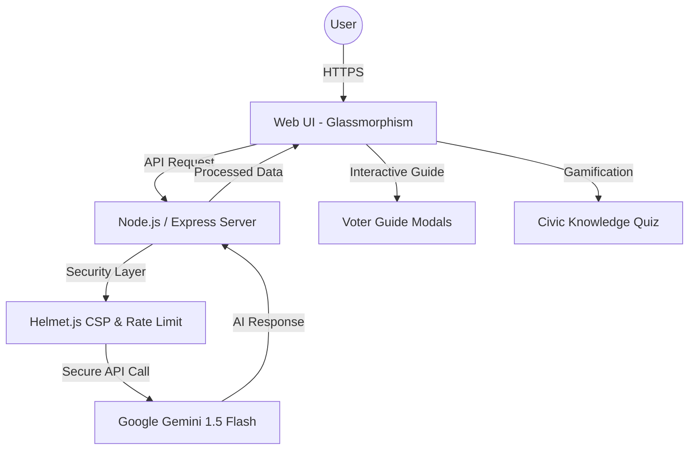

# 🗳️ ElectroBot AI: Election Education Platform
**Winner-Ready Entry for PromptWars Challenge 2**

ElectroBot AI is a premium, AI-powered educational platform designed to empower Indian citizens with knowledge about their democratic rights and the electoral process. 

##  Key Features
- ** Smart AI Assistant:** Powered by Google Gemini 1.5 Flash, providing real-time, accurate answers about Indian elections.
- ** Complete Voter Guide:** Interactive, step-by-step guide with detailed modals for everything from registration (Form 6) to casting a vote at the EVM.
- ** Interactive Civic Quiz:** A gamified experience to test and improve your knowledge of Indian democracy.
- ** Voter Rights Dashboard:** A dedicated section to learn about fundamental rights like the Secret Ballot and NOTA.
- ** Secure & Scalable:** Built with Node.js, Express, and Helmet for a secure, production-ready backend.

##  Technology Stack
- **Frontend:** Vanilla HTML5, CSS3 (Glassmorphism design), Modern JavaScript.
- **Backend:** Node.js, Express.js.
- **AI Engine:** Google Gemini Pro / Flash (v1beta API).
- **Security:** Helmet.js (CSP enabled), Rate Limiting.

##  Setup & Installation
1. Clone the repository.
2. Install dependencies: `npm install`.
3. Create a `.env` file with your `GEMINI_API_KEY`.
4. Run the app: `npm run dev`.
5. Access via: `http://localhost:8080`.

## 🏗️ Technical Architecture


## 📂 Project Structure
```text
ElectroBot-AI/
├── public/             # Frontend assets (HTML, CSS, JS)
│   ├── index.html      # Main entry point
│   ├── style.css       # Premium Glassmorphism UI
│   └── app.js          # Core frontend logic & AI integration
├── server.js           # Secure Express backend & Gemini Proxy
├── Dockerfile          # Containerization for Cloud Run
├── LICENSE             # MIT License
└── package.json        # Dependencies & Scripts
```

## 🛡️ Security Features
- **Backend Proxy:** Gemini API keys are never exposed to the client-side.
- **Content Security Policy (CSP):** Strict headers implemented via Helmet.js.
- **Rate Limiting:** Prevents API abuse and ensures service availability.
- **Validation:** Sanitzed inputs for all AI prompts.

## 🇮🇳 Why it matters?
With over 900 million voters, India's democracy thrives on informed participation. ElectroBot AI bridges the gap between complex election laws and the common citizen through an intuitive, AI-driven interface.

---
*Created with  for PromptWars Challenge 2.*

## 🔗 Live Demo
[Visit ElectroBot AI Live](https://electrobot-ai-487149914287.us-central1.run.app)
